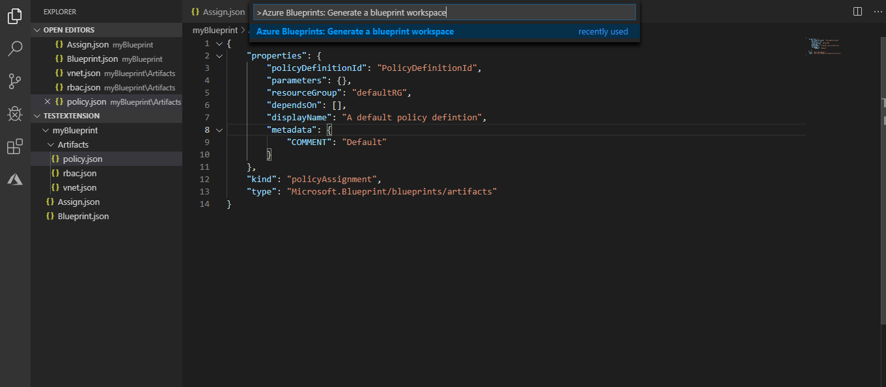
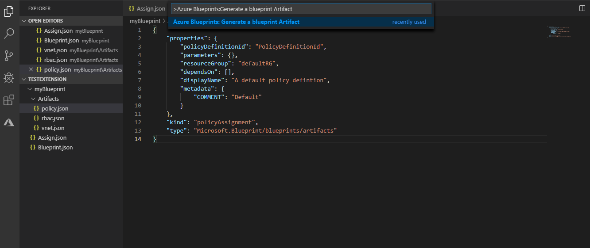

# Azure Blueprints Code Generator

The Azure Blueprint Code Generator is an extention which creates an Azure Blueprint workspace with the necessary JSON files to deploy a Blueprints using code. It also creates artifactes of type template, Rbac assignment and Policy Assignment.

## Features

First thing that this extention can do is to create a blueprint workspace : 

* Use command ** Azure Blueprints: Generate a blueprint workspace **  

> This will generate the `Assign.json`, `Blueprint.json` and `/Artifacts` with a default template inside.

The extention can also create an Azure Blueprints artifact of type `template`, `rbac` or `policy`:

* Use command ** Azure Blueprints: Generate a blueprint Artifact **  

> This will generate the wanted artifact type with a default template inside.

## Release Notes

### 0.0.1

* Generate an Azure Blueprints workspace
* Generate an Azure Blueprints Artifact
