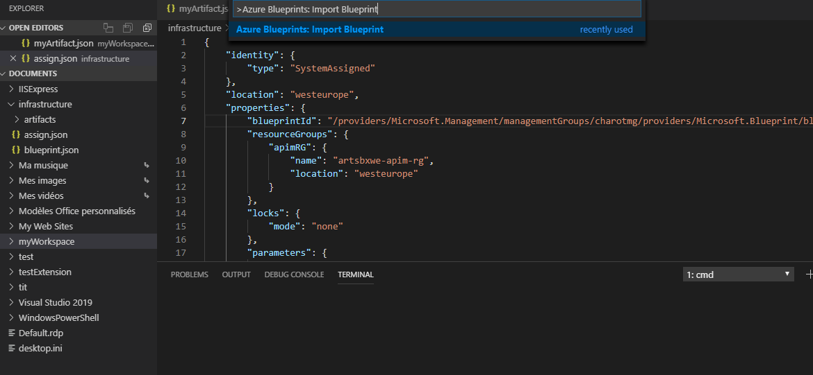
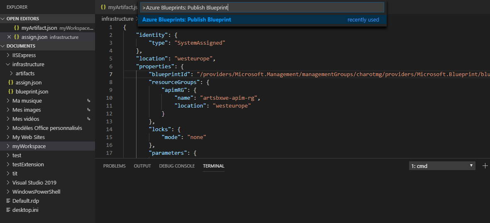
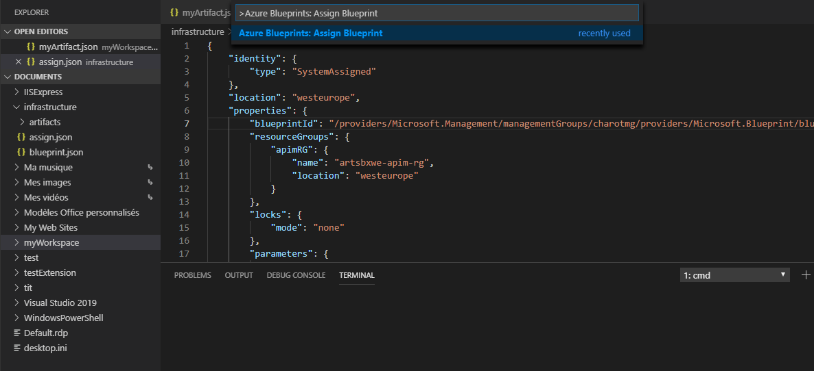
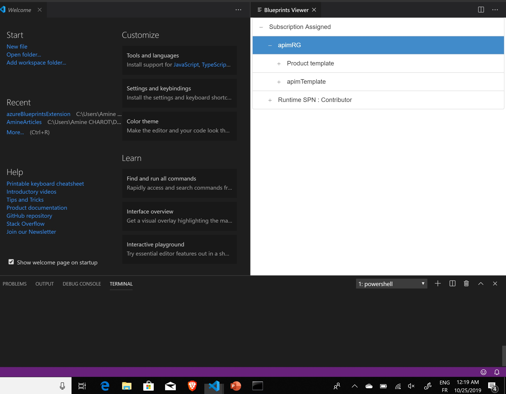

#  Azure Blueprints Code Generator

   

The Azure Blueprint Code Generator is an extension which creates an Azure Blueprint workspace with the necessary JSON files to deploy a Blueprint using code. It also creates artifacts of type Template, Rbac assignment and Policy Assignment.

## Features

First thing that this extension can do is creating a blueprint workspace :
- Use command **Azure Blueprints: Generate a blueprint workspace**  
  

> This will generate the `Assign.json`, `Blueprint.json` and `/Artifacts` with a default template inside.

The extension can also create an Azure Blueprints artifact of type `template`, `rbac` or `policy`:

- Use command **Azure Blueprints: Generate a blueprint Artifact**  
  

> This will generate the wanted artifact type with a default template inside.

Do you want to test your blueprint without writing scripts? No problem, we have the solution :

### Requirement :

- Azure Powershell and Az.Blueprint Module

To import the blueprint :

- Use command **Azure Blueprints: Import Blueprint**  
  

### Requirement :

- Blueprint workspace (Blueprint.json and Artifacts)
- Management Group Id
  > This will import the blueprint to Azure.

To publish the blueprint :

- Use command **Azure Blueprints: Publish Blueprint**  
  

### Requirement :

- Blueprint name
- Blueprint version
- Management Group Id
  > This will publish the imported blueprint.

To Assign the blueprint :

- Use command **Azure Blueprints: Assign Blueprint**  
  

### Requirement :

- Blueprint name
- Blueprint version
- Management Group Id
- Subscription Id
- Blueprint workspace (Assign.json)
  > This will assign the publishd blueprint.

NOTE : The blueprint workspace MUST be in the root ! The blueprint name in Azure will have the SAME name as the workspace !

- Use command **Azure Blueprints: Preview Blueprint**  
  

> This will preview the workspace that will be imported to Azure.

To Export a blueprint :

- Use command **Azure Blueprints: Export Blueprint**  

### Requirement :

- Blueprint name
- Blueprint version
- Management Group Id
- Output path
  > This will export your blueprints in Azure to your local drive.

# Contribution

This extension is open source and hosted on [Github](https://github.com/charotAmine/azureBlueprintsExtension). Contributions are more than welcome. Feel free to fork and add new features or submit bug reports.